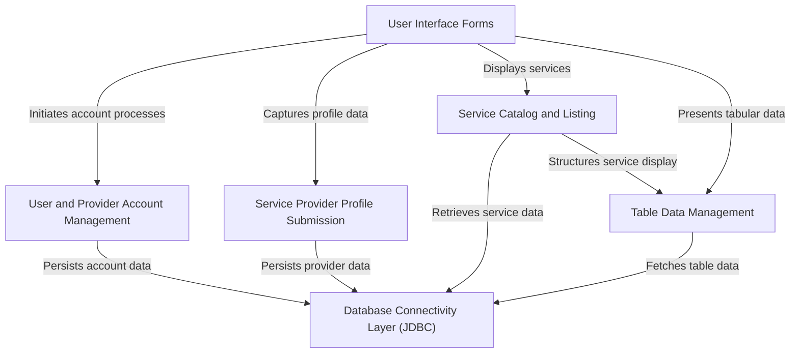
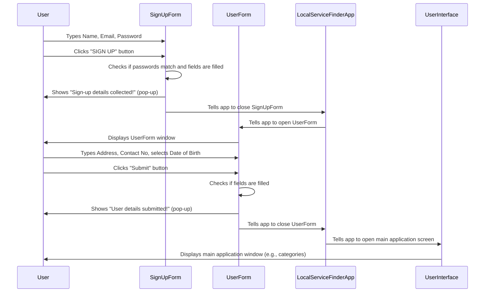
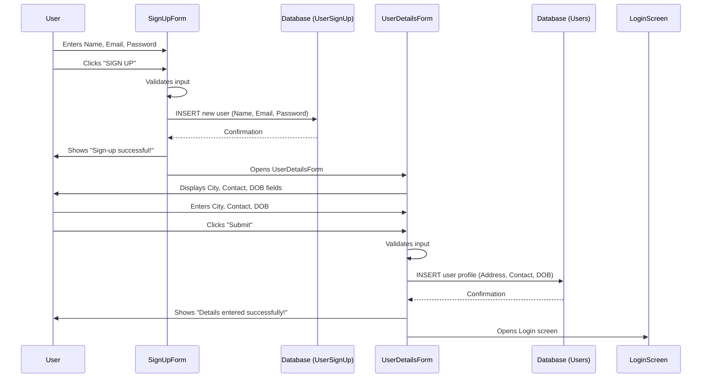
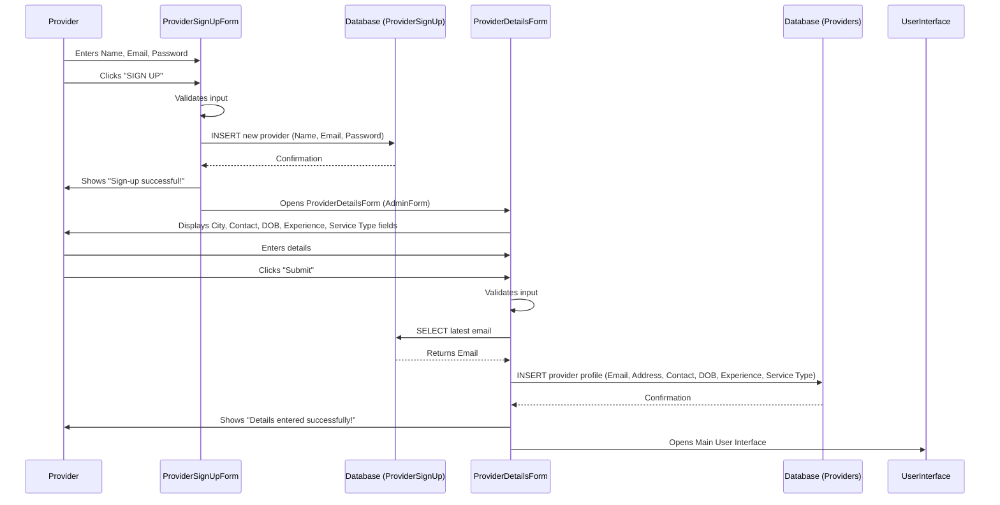
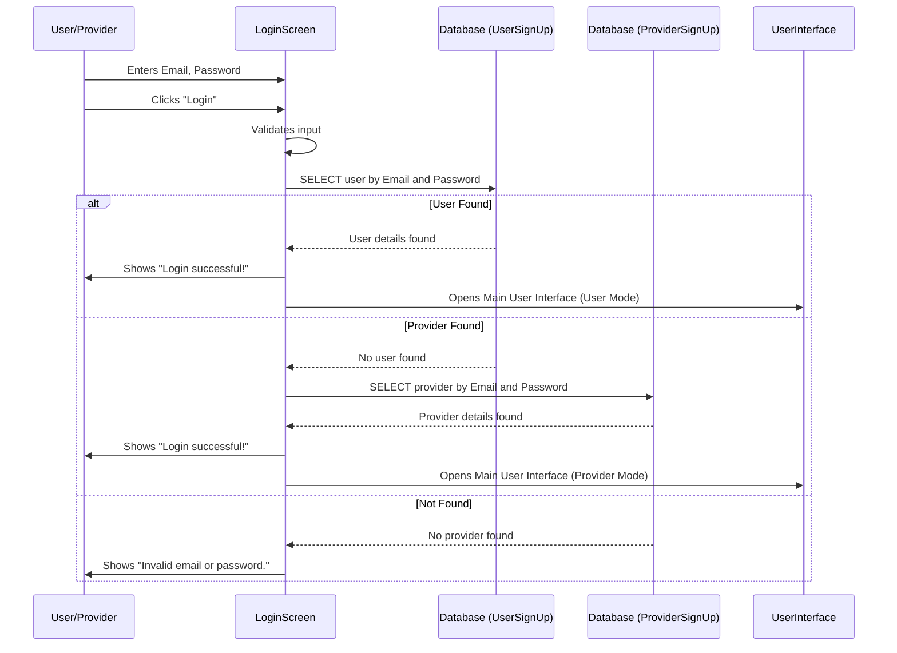
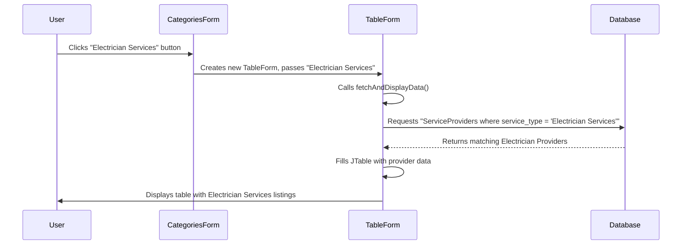
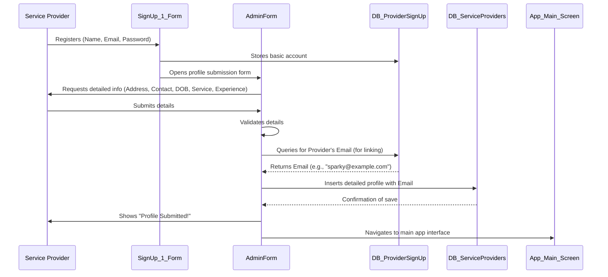
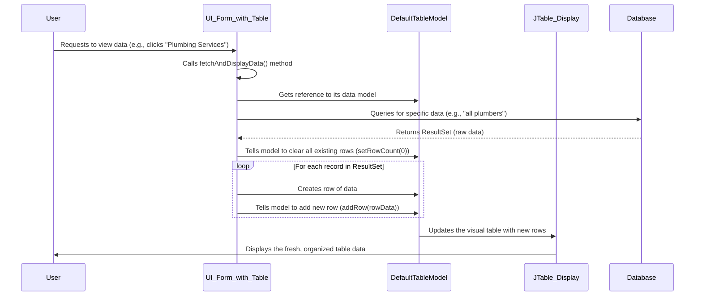
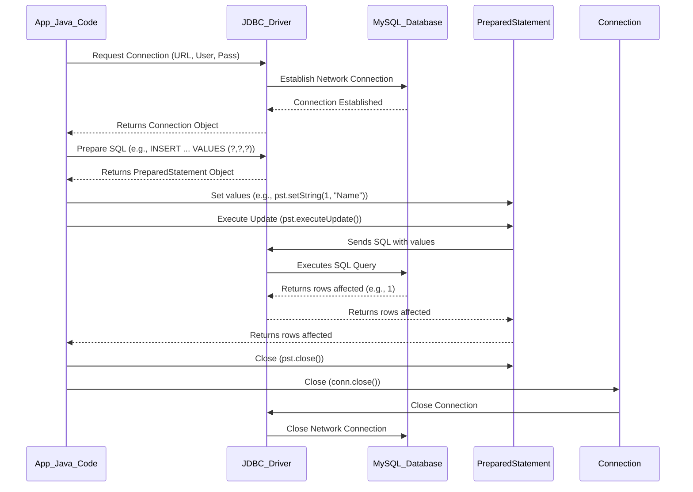

# Tutorial: Local_Service_Finder

`Local_Service_Finder` is a **Java Swing application** designed to *connect users with local service providers*. It features intuitive **user interface forms** for account management, allowing both users and service providers to sign up and log in. Service providers can **submit detailed profiles** of their offerings, which are then displayed in a browsable **service catalog**. All critical application data, including accounts and service details, is *persisted and retrieved using a robust JDBC database connectivity layer*.


## Visual Overview



## Chapters

1. [User Interface Forms
](01_user_interface_forms_.md)
2. [User and Provider Account Management
](02_user_and_provider_account_management_.md)
3. [Service Catalog and Listing
](03_service_catalog_and_listing_.md)
4. [Service Provider Profile Submission
](04_service_provider_profile_submission_.md)
5. [Table Data Management
](05_table_data_management_.md)
6. [Database Connectivity Layer (JDBC)
](06_database_connectivity_layer__jdbc__.md)

---

# Chapter 1: User Interface Forms

Welcome to the `Local_Service_Finder` project tutorial! In this first chapter, we're going to explore the very first thing you see and interact with in any software: the "User Interface Forms." Think of these as the beautiful, interactive screens that make using an app a breeze.

## What Problem Do User Interface Forms Solve?

Imagine trying to order food or find a local electrician without any buttons to click, text boxes to type into, or lists to browse. Impossible, right? User Interface Forms are here to solve exactly that problem!

They are the **graphical windows and screens** that you, the user, interact with. Each form is like a page in a book, serving a specific purpose. For our `Local_Service_Finder` application, this means forms for:

*   **Signing Up**: Where you tell the app who you are.
*   **Logging In**: Where you securely access your account.
*   **Entering Details**: Providing your address, contact, and other information.
*   **Displaying Services**: Showing you a list of available electricians, plumbers, etc.

These forms are built using special Java tools called **Java Swing components**, like text fields (for typing), buttons (for clicking), and tables (for displaying lists). They are the "front-end" – the part you see – that connects your actions (like clicking "Submit") to the "back-end" (the hidden logic that saves your data or fetches information).

Let's use a central example: **Signing up as a new user and entering your basic profile information.** This involves two main forms working together: a "Sign Up" form and a "User Details" form.

## Key Concepts of User Interface Forms

Before we dive into the code, let's understand the basic ingredients of these forms.

### 1. The Form Itself: `JFrame`

In Java Swing, a "form" (or window) is often represented by a `JFrame`. Think of a `JFrame` as an empty canvas or a blank window on your computer screen. You can put all sorts of interactive elements inside it.

### 2. Building Blocks: UI Components

Inside a `JFrame`, you place "UI Components." These are the interactive elements users see and click.

| Component Type   | Analogy              | What it does                                                 |
| :--------------- | :------------------- | :----------------------------------------------------------- |
| `JLabel`         | A sticky note        | Displays static text or images (e.g., "Email:", "Password:") |
| `JTextField`     | A blank line in a form | Lets users type short pieces of text (e.g., their name, email) |
| `JPasswordField` | A hidden text line   | Similar to `JTextField`, but hides typed characters (e.g., for passwords) |
| `JButton`        | A physical button    | Lets users trigger an action when clicked (e.g., "Submit", "Login") |
| `JComboBox`      | A dropdown list      | Presents a list of options for users to choose from          |
| `JTable`         | A spreadsheet        | Displays data in rows and columns, like a list of service providers |
| `JPanel`         | A section divider    | Organizes and groups other components within a form          |

### 3. Making Them Alive: Event Handling

Components aren't just for show! When you click a `JButton` or type into a `JTextField`, something needs to happen. This is called "event handling." We use special code called an `ActionListener` that waits for an event (like a button click) and then performs a specific task.

## Solving Our Use Case: Signing Up and Entering Details

Let's look at how the `Local_Service_Finder` uses forms for the sign-up process.

### Step 1: The `SignUp` Form

When a new user wants to join, they first see the `SignUp` form. This form collects their name, email, and a new password.

Here's a simplified look at the `SignUp.java` file, focusing on the key UI components:

```java
// File: LoginAndSignUp/src/loginandsignup/SignUp.java

import javax.swing.*; // Needed for UI components

public class SignUp extends JFrame { // This is our main window!

    private JTextField nameField; // To type in your name
    private JTextField emailField; // To type in your email
    private JPasswordField passwordField; // To type your password
    private JButton signUpButton; // The button to click!

    public SignUp() {
        initComponents(); // This method sets up all visual parts
    }

    private void initComponents() {
        // Imagine lots of code here that creates the window,
        // adds labels like "Full name", "Email", "Password",
        // and sets up the text fields and buttons.

        nameField = new JTextField(); // Create the name text box
        emailField = new JTextField(); // Create the email text box
        passwordField = new JPasswordField(); // Create password text box
        signUpButton = new JButton("SIGN UP"); // Create the "SIGN UP" button

        // This line makes the button *do* something when clicked!
        signUpButton.addActionListener(new java.awt.event.ActionListener() {
            public void actionPerformed(java.awt.event.ActionEvent evt) {
                handleSignUpButtonClick(); // Call our custom method
            }
        });

        // ... more code to add these components to the window ...
    }

    private void handleSignUpButtonClick() {
        // We will explain what happens here in a moment!
        System.out.println("Sign Up button clicked!");
    }

    public static void main(String args[]) {
        // This is how we make the SignUp form appear when the app starts.
        java.awt.EventQueue.invokeLater(new Runnable() {
            public void run() {
                new SignUp().setVisible(true); // Make the window visible
            }
        });
    }
}
```
**Explanation:**
*   `public class SignUp extends JFrame`: This line tells Java that our `SignUp` class is a window (a `JFrame`).
*   `JTextField`, `JPasswordField`, `JButton`: These are the components we mentioned earlier. Notice how each one has a specific name (like `nameField`, `emailField`) to identify it.
*   `initComponents()`: This method, often automatically generated by design tools, contains all the code to create and arrange the visual elements of the form.
*   `signUpButton.addActionListener(...)`: This is super important! It's how we make the button respond to a click. When the `signUpButton` is pressed, the `handleSignUpButtonClick()` method is called.
*   `main` method: This is the starting point. It creates a `SignUp` form and makes it appear on your screen.

When you run this (simplified) code, you'd see a window with fields to enter a name, email, and password, along with a "SIGN UP" button.

### Step 2: The `UserForm` Form

After a successful sign-up, the app needs more details from the user, like their address and date of birth. This is where the `UserForm` comes in. The `SignUp` form will *open* this `UserForm` once the initial sign-up is complete.

Here's a simplified view of the `UserForm.java` file:

```java
// File: LoginAndSignUp/src/loginandsignup/UserForm.java

import javax.swing.*;

public class UserForm extends JFrame { // Another window for user details

    private JTextField addressField; // For typing address
    private JTextField contactNoField; // For typing contact number
    // private JDateChooser dobChooser; // (Imagine a special date picker here)
    private JButton submitButton; // The button to submit details

    public UserForm() {
        initComponents();
    }

    private void initComponents() {
        // Similar to SignUp, this sets up the window with labels,
        // text fields, and a submit button.

        addressField = new JTextField();
        contactNoField = new JTextField();
        // dobChooser = new JDateChooser();
        submitButton = new JButton("Submit");

        submitButton.addActionListener(new java.awt.event.ActionListener() {
            public void actionPerformed(java.awt.event.ActionEvent evt) {
                handleSubmitButtonClick(); // Our method for this button
            }
        });
        // ... more code ...
    }

    private void handleSubmitButtonClick() {
        // We'll see what happens here in the next section!
        System.out.println("Submit button clicked!");
    }

    public static void main(String args[]) {
        java.awt.EventQueue.invokeLater(new Runnable() {
            public void run() {
                new UserForm().setVisible(true);
            }
        });
    }
}
```
**Explanation:**
*   This form is very similar to `SignUp`, but it gathers different information: `addressField`, `contactNoField`.
*   It also has a `submitButton` which, when clicked, calls `handleSubmitButtonClick()`.

## What Happens Behind the Scenes?

When you interact with these forms, here's a simplified step-by-step process of what happens:



**Non-Code Walkthrough:**
1.  **User Enters Data**: You type your name, email, and password into the `SignUp` form's text fields.
2.  **Button Click**: You click the "SIGN UP" button.
3.  **Form Responds**: The `SignUp` form's special code (the `ActionListener` we talked about) springs into action.
4.  **Data Collection & Validation**: This code first "reads" what you typed from each text field. It then does a quick check: "Are all fields filled?" "Do the passwords match?"
5.  **Feedback**: If something is wrong (like mismatched passwords), a small message box (a `JOptionPane`) pops up to tell you. If everything is correct, you get a "Sign-up details collected!" message.
6.  **Transition to Next Form**: Crucially, after successful collection, the `SignUp` form closes itself (`this.dispose()`) and then tells the application to open the `UserForm` (`new UserForm().setVisible(true)`). This creates the next "page" for you to interact with.
7.  **User Enters More Data**: On the `UserForm`, you input your address and contact information.
8.  **Submit Button Click**: You click the "Submit" button.
9.  **Second Form Responds**: The `UserForm`'s `ActionListener` takes over, reads the new data, and performs basic checks.
10. **Final Transition**: After successful submission, the `UserForm` closes, and the main application screen (like `UserInterface.java` or `Categories.java`) appears, ready for you to explore services!

### Code Deep Dive: How Forms Talk to Each Other

Let's look at the actual code that makes one form open another and how data is handled *within* the forms.

When you click the "SIGN UP" button on `SignUp.java`, the `jButton1ActionPerformed` (renamed to `handleSignUpButtonClick` in our simplified example for clarity) method is executed.

```java
// Simplified snippet from LoginAndSignUp/src/loginandsignup/SignUp.java
private void jButton1ActionPerformed(java.awt.event.ActionEvent evt) {
    String userName = name.getText();           // Get text from name field
    String userEmail = email.getText();         // Get text from email field
    String userPassword = new String(password.getPassword()); // Get password

    // Basic checks (like checking if fields are empty or passwords match)
    if (userName.isEmpty() || userEmail.isEmpty() || userPassword.isEmpty()) {
        JOptionPane.showMessageDialog(this, "Please fill all fields");
        return;
    }
    if (!userPassword.equals(new String(confirmpassword.getPassword()))) {
        JOptionPane.showMessageDialog(this, "Passwords do not match.");
        return;
    }

    // If all checks pass:
    JOptionPane.showMessageDialog(this, "Sign-up details collected!");
    this.dispose(); // Close the current SignUp window
    
    // Create and show the next form: UserForm
    UserForm UserFormFrame = new UserForm();
    UserFormFrame.setVisible(true);
    UserFormFrame.pack(); // Adjusts window size to fit components
    UserFormFrame.setLocationRelativeTo(null); // Centers the window
}
```
**Explanation:**
*   `name.getText()`, `email.getText()`, `password.getPassword()`: These lines are how the form "reads" what the user typed into the `JTextField` and `JPasswordField` components. Remember that passwords are handled as character arrays for security, so `new String(...)` is used to convert it.
*   `JOptionPane.showMessageDialog(this, "...")`: This pops up a small message box on the screen, a friendly way to give feedback to the user.
*   `this.dispose()`: This command tells the *current* `SignUp` window to close itself.
*   `new UserForm().setVisible(true)`: This is the magic! It creates a brand new `UserForm` and makes it appear on the screen, seamlessly moving the user to the next step.
*   `UserFormFrame.pack()`: This method tells the window to resize itself to perfectly fit all its contents.
*   `UserFormFrame.setLocationRelativeTo(null)`: This command centers the new window on the user's screen.

A similar process happens in the `UserForm.java` file when the "Submit" button is clicked:

```java
// Simplified snippet from LoginAndSignUp/src/loginandsignup/UserForm.java
private void jButton1ActionPerformed(java.awt.event.ActionEvent evt) {
    String userAddress = address.getText();         // Get text from address field
    String userContactNo = contactno.getText();     // Get text from contact field
    // (Date input from JDateChooser is a bit more complex, simplified for now)

    // Basic check for empty fields
    if (userAddress.isEmpty() || userContactNo.isEmpty()) {
        JOptionPane.showMessageDialog(this, "Please fill all fields");
        return;
    }

    // If details are collected:
    JOptionPane.showMessageDialog(this, "User details submitted!");
    this.dispose(); // Close the current UserForm window

    // Now, open the main User Interface
    UserInterface UserInterfaceFrame = new UserInterface();
    UserInterfaceFrame.setVisible(true);
    UserInterfaceFrame.pack();
    UserInterfaceFrame.setLocationRelativeTo(null);
}
```
**Explanation:**
*   This code also uses `getText()` to read from its text fields.
*   It performs a similar check for empty fields.
*   Finally, it closes the `UserForm` and opens the main `UserInterface` (which is often the `UserInterface.java` or `Categories.java` screen in this project), providing access to service categories.

## Conclusion

In this chapter, we've learned that User Interface Forms are the visual heart of our `Local_Service_Finder` application. They are the windows and screens users interact with, built using components like text fields and buttons. We saw how forms collect input, perform basic checks, and seamlessly navigate the user from one step (like signing up) to the next (entering profile details) by opening and closing windows.

These forms are crucial because they are the "face" of the application, allowing users to communicate their needs and view information. In the next chapter, we will delve into [User and Provider Account Management](02_user_and_provider_account_management_.md), where we'll explore how the data collected by these forms is used to create and manage user and service provider accounts.

---

<sub><sup>Generated by [AI Codebase Knowledge Builder](https://github.com/The-Pocket/Tutorial-Codebase-Knowledge).</sup></sub> <sub><sup>**References**: [[1]](https://github.com/Vighnesh7711/Local_Service_Finder/blob/9502b912dba73f9832ad2cb9d8a787ede00def6f/LoginAndSignUp/src/AdminForm1.java), [[2]](https://github.com/Vighnesh7711/Local_Service_Finder/blob/9502b912dba73f9832ad2cb9d8a787ede00def6f/LoginAndSignUp/src/NewJFrame.java), [[3]](https://github.com/Vighnesh7711/Local_Service_Finder/blob/9502b912dba73f9832ad2cb9d8a787ede00def6f/LoginAndSignUp/src/loginandsignup/AdminForm.java), [[4]](https://github.com/Vighnesh7711/Local_Service_Finder/blob/9502b912dba73f9832ad2cb9d8a787ede00def6f/LoginAndSignUp/src/loginandsignup/Categories.java), [[5]](https://github.com/Vighnesh7711/Local_Service_Finder/blob/9502b912dba73f9832ad2cb9d8a787ede00def6f/LoginAndSignUp/src/loginandsignup/Login.java), [[6]](https://github.com/Vighnesh7711/Local_Service_Finder/blob/9502b912dba73f9832ad2cb9d8a787ede00def6f/LoginAndSignUp/src/loginandsignup/SignUp.java), [[7]](https://github.com/Vighnesh7711/Local_Service_Finder/blob/9502b912dba73f9832ad2cb9d8a787ede00def6f/LoginAndSignUp/src/loginandsignup/SignUp_1.java), [[8]](https://github.com/Vighnesh7711/Local_Service_Finder/blob/9502b912dba73f9832ad2cb9d8a787ede00def6f/LoginAndSignUp/src/loginandsignup/Table.java), [[9]](https://github.com/Vighnesh7711/Local_Service_Finder/blob/9502b912dba73f9832ad2cb9d8a787ede00def6f/LoginAndSignUp/src/loginandsignup/UserForm.java), [[10]](https://github.com/Vighnesh7711/Local_Service_Finder/blob/9502b912dba73f9832ad2cb9d8a787ede00def6f/LoginAndSignUp/src/loginandsignup/UserInterface.java), [[11]](https://github.com/Vighnesh7711/Local_Service_Finder/blob/9502b912dba73f9832ad2cb9d8a787ede00def6f/LoginAndSignUp/src/loginandsignup/UserInterfaceee.java)</sup></sub>

# Chapter 2: User and Provider Account Management

Welcome back to the `Local_Service_Finder` project! In [Chapter 1: User Interface Forms](01_user_interface_forms_.md), we learned how the application uses interactive screens (forms) to collect information from you, like your name, email, and password during sign-up. Those forms are the "face" of our application.

But what happens *after* you click that "SIGN UP" button or "Login" button? How does the app remember you? How does it know if you're a regular user looking for services or a skilled professional offering them? That's exactly what "User and Provider Account Management" is all about!

## What Problem Does Account Management Solve?

Imagine a large community where people want to find services (like a plumber) and others want to offer services (like a plumber!). Without a system to register and identify everyone, it would be pure chaos. You wouldn't know who's who, or if they're allowed to use the service.

Account management is like the **enrollment and identification system** for our `Local_Service_Finder` community. It solves the problem of:

*   **Who are you?**: It registers new people into the system.
*   **Are you who you say you are?**: It verifies that existing users are legitimate.
*   **What can you do?**: It helps the app understand if you're a service *seeker* or a service *provider*, so it can show you the right options.

Our central example for this chapter will be: **How the `Local_Service_Finder` creates and manages distinct accounts for both regular users and service providers, allowing them to sign up and log in securely.**

## Key Concepts of Account Management

To manage accounts, we need to understand a few core ideas:

### 1. Two Types of Accounts: User vs. Provider

The `Local_Service_Finder` needs to treat people differently based on whether they are *looking* for services or *offering* them.

| Account Type      | Purpose                               | Key Information Stored (Initial)      | Initial Sign-up Form      |
| :---------------- | :------------------------------------ | :------------------------------------ | :------------------------ |
| **User Account**  | Seeks services (e.g., find a plumber) | Name, Email, Password                 | `SignUp.java`             |
| **Provider Account** | Offers services (e.g., a plumber)   | Name, Email, Password, (later: Service Type, Experience) | `SignUp_1.java`           |

Notice that both start with basic identification, but providers will need to add more details later.

### 2. Creating an Account: Sign Up

This is the process where a new person joins our community. It involves:
*   **Providing Basic Info**: Name, email, and a chosen password.
*   **Validation**: Checking if the email is valid, passwords match, and fields aren't empty.
*   **Storing Information**: Saving this new account data.

### 3. Accessing an Account: Login

Once an account is created, you need a way to get back in.
*   **Providing Credentials**: Entering your registered email and password.
*   **Verification**: The system checks if the email and password match a stored account.
*   **Granting Access**: If verified, you get into your account, and the app knows if you're a user or a provider.

## How Account Management Solves Our Use Case

Let's see how `Local_Service_Finder` handles sign-up and login for both types of accounts.

### Step 1: Signing Up - Different Forms for Different Roles

The application uses two different sign-up forms to collect initial information based on whether you're a regular user or a service provider.

#### 1. User Sign Up (`SignUp.java`)

This is what we briefly touched on in Chapter 1. It collects your name, email, and password. After these basic details are entered, you are then prompted to provide more *user-specific* details like your address and contact number on a `UserForm`.

```java
// Simplified from LoginAndSignUp/src/loginandsignup/SignUp.java

import javax.swing.JOptionPane;
import java.sql.Connection;
import java.sql.DriverManager;
import java.sql.PreparedStatement;
import java.sql.SQLException;

public class SignUp extends javax.swing.JFrame {
    // ... (UI component declarations like name, email, password, confirmpassword) ...

    private void jButton1ActionPerformed(java.awt.event.ActionEvent evt) {
        String userName = name.getText();
        String userEmail = email.getText();
        String userPassword = new String(password.getPassword());
        String userConfirmPassword = new String(confirmpassword.getPassword());

        // Basic input validation (e.g., check for empty fields, email format, matching passwords)
        if (userName.isEmpty() || userEmail.isEmpty() || userPassword.isEmpty() || userConfirmPassword.isEmpty()) {
            JOptionPane.showMessageDialog(this, "Please fill all fields"); return;
        }
        if (!userEmail.contains("@")) {
            JOptionPane.showMessageDialog(this, "Invalid email!"); return;
        }
        if (!userPassword.equals(userConfirmPassword)) {
            JOptionPane.showMessageDialog(this, "Passwords do not match. Please try again."); return;
        }

        // Database interaction starts here!
        try {
            Connection conn = DriverManager.getConnection("jdbc:mysql://localhost:3306/ServiceApp", "root", "student");
            String sql = "INSERT INTO UserSignUp (name, email, password) VALUES (?, ?, ?)";
            PreparedStatement pst = conn.prepareStatement(sql);
            pst.setString(1, userName);
            pst.setString(2, userEmail);
            pst.setString(3, userPassword);

            int rowsAffected = pst.executeUpdate(); // This sends data to the database
            if (rowsAffected > 0) {
                JOptionPane.showMessageDialog(this, "Sign-up successful!");
                this.dispose(); // Close current form
                new UserForm().setVisible(true); // Open the next form for more details
            } else {
                JOptionPane.showMessageDialog(this, "Sign-up failed. Please try again.");
            }
            pst.close();
            conn.close();
        } catch (SQLException e) {
            e.printStackTrace();
            JOptionPane.showMessageDialog(this, "Sign-up error: " + e.getMessage());
        }
    }
    // ... (other methods and main) ...
}
```
**Explanation:**
*   This code snippet shows the `jButton1ActionPerformed` method, which is called when the "SIGN UP" button is clicked.
*   It first **gets the text** entered by the user for name, email, and password.
*   Then, it performs **basic checks** (validation) to ensure the input is correct. If not, it shows a message using `JOptionPane`.
*   The most important part here is the `INSERT INTO UserSignUp` SQL command. This is how the basic user account (name, email, password) is **saved into a database table** called `UserSignUp`.
*   After successful saving, it closes the `SignUp` form and opens the `UserForm` to collect more details.

#### 2. Provider Sign Up (`SignUp_1.java`)

For service providers, there's a slightly different sign-up flow. The initial `SignUp_1.java` form is very similar to the regular user sign-up, but it leads to a different form (`AdminForm`) for collecting provider-specific details.

```java
// Simplified from LoginAndSignUp/src/loginandsignup/SignUp_1.java

import javax.swing.JOptionPane;
import java.sql.Connection;
import java.sql.DriverManager;
import java.sql.PreparedStatement;
import java.sql.SQLException;

public class SignUp_1 extends javax.swing.JFrame {
    // ... (UI component declarations like name, email, password, confirmpassword) ...

    private void jButton1ActionPerformed(java.awt.event.ActionEvent evt) {
        String userName = name.getText();
        String userEmail = email.getText();
        String userPassword = new String(password.getPassword());
        String userConfirmPassword = new String(confirmpassword.getPassword());

        // Basic input validation (similar to SignUp.java)
        if (userName.isEmpty() || userEmail.isEmpty() || userPassword.isEmpty() || userConfirmPassword.isEmpty()) {
            JOptionPane.showMessageDialog(this, "Please fill all fields"); return;
        }
        if (!userEmail.contains("@")) {
            JOptionPane.showMessageDialog(this, "Invalid email!"); return;
        }
        if (!userPassword.equals(userConfirmPassword)) {
            JOptionPane.showMessageDialog(this, "Passwords do not match. Please try again."); return;
        }

        // Database interaction
        try {
            Connection conn = DriverManager.getConnection("jdbc:mysql://localhost:3306/ServiceApp", "root", "student");
            String sql = "INSERT INTO ServiceProvidersSignUp (name, email, password) VALUES (?, ?, ?)";
            PreparedStatement pst = conn.prepareStatement(sql);
            pst.setString(1, userName);
            pst.setString(2, userEmail);
            pst.setString(3, userPassword);

            int rowsAffected = pst.executeUpdate();
            if (rowsAffected > 0) {
                JOptionPane.showMessageDialog(this, "Sign-up successful!");
                this.dispose(); // Close current form
                new AdminForm().setVisible(true); // Open the AdminForm for provider details
            } else {
                JOptionPane.showMessageDialog(this, "Sign-up failed. Please try again.");
            }
            pst.close();
            conn.close();
        } catch (SQLException e) {
            e.printStackTrace();
            JOptionPane.showMessageDialog(this, "Sign-up error: " + e.getMessage());
        }
    }
    // ...
}
```
**Explanation:**
*   This code works almost identically to `SignUp.java`, but it inserts the data into a different table: `ServiceProvidersSignUp`. This keeps user and provider basic login details separate.
*   After successful sign-up, it opens `AdminForm` instead of `UserForm`. This is important for collecting specific provider information.

### Step 2: Collecting Detailed Profile Information

After the initial sign-up, both users and providers are directed to forms to input more specific details. This data is stored in separate tables, linking back to their initial sign-up using their email (or implicitly through order of entry).

#### 1. User Details Form (`UserForm.java`)

This form collects location and contact details for regular users.

```java
// Simplified from LoginAndSignUp/src/loginandsignup/UserForm.java

import javax.swing.JOptionPane;
import java.sql.Connection;
import java.sql.DriverManager;
import java.sql.PreparedStatement;
import java.sql.SQLException;
import java.text.SimpleDateFormat;
import java.util.Date;

public class UserForm extends javax.swing.JFrame {
    // ... (UI components for address, contactno, jDateChooser2) ...

    private void jButton1ActionPerformed(java.awt.event.ActionEvent evt) {
        String userAddress = address.getText();
        String userContactNo = contactno.getText();
        Date userDob = jDateChooser2.getDate();

        if (userAddress.isEmpty() || userContactNo.isEmpty() || userDob == null) {
            JOptionPane.showMessageDialog(this, "Please fill all fields"); return;
        }

        SimpleDateFormat dateFormat = new SimpleDateFormat("yyyy-MM-dd");
        String dobString = dateFormat.format(userDob);

        try {
            Connection conn = DriverManager.getConnection("jdbc:mysql://localhost:3306/ServiceApp", "root", "student");
            // IMPORTANT: This insert does not explicitly link to UserSignUp by email in this snippet.
            // In a real app, you would pass the email from the previous form or use user IDs.
            String sql = "INSERT INTO Users (address, contact_number, DOB) VALUES (?, ?, ?)";
            PreparedStatement pst = conn.prepareStatement(sql);
            pst.setString(1, userAddress);
            pst.setString(2, userContactNo);
            pst.setString(3, dobString);

            int rowsAffected = pst.executeUpdate();
            if (rowsAffected > 0) {
                JOptionPane.showMessageDialog(this, "Entered Detail successfully!");
                this.dispose();
                new Login().setVisible(true); // Go to login after completing user details
            } else {
                JOptionPane.showMessageDialog(this, "Failed. Please try again.");
            }
            pst.close();
            conn.close();
        } catch (SQLException e) {
            e.printStackTrace();
            JOptionPane.showMessageDialog(this, "Error: " + e.getMessage());
        }
    }
    // ...
}
```
**Explanation:**
*   This form collects `address`, `contact_number`, and `DOB` (Date of Birth).
*   It inserts these into the `Users` table in the database.
*   After submitting, it directs the user to the `Login` form.

#### 2. Provider Details Form (`AdminForm.java`)

This form collects more specific professional details for service providers.

```java
// Simplified from LoginAndSignUp/src/loginandsignup/AdminForm.java

import javax.swing.JOptionPane;
import java.sql.Connection;
import java.sql.DriverManager;
import java.sql.PreparedStatement;
import java.sql.ResultSet; // Needed to get email from previous table
import java.sql.SQLException;
import java.text.SimpleDateFormat;
import java.util.Date;

public class AdminForm extends javax.swing.JFrame {
    // ... (UI components for address1, contactno1, experience, box, jDateChooser2) ...

    private void jButton1ActionPerformed(java.awt.event.ActionEvent evt) {
        String adminAddress = address1.getText();
        String adminContactNo = contactno1.getText();
        Date adminDob = jDateChooser2.getDate();     
        String adminExperience = experience.getText();
        String adminService = box.getSelectedItem().toString(); // From a dropdown

        if (adminAddress.isEmpty() || adminContactNo.isEmpty() || adminDob == null || adminService.isEmpty() || adminExperience.isEmpty()) {
            JOptionPane.showMessageDialog(this, "Please fill all fields"); return;
        }
        if (!adminContactNo.matches("\\d{10}")) { // Check for 10 digits
            JOptionPane.showMessageDialog(this, "Contact number must be exactly 10 digits"); return;
        }

        SimpleDateFormat dateFormat = new SimpleDateFormat("yyyy-MM-dd");
        String dobString = dateFormat.format(adminDob);

        PreparedStatement pst = null;
        PreparedStatement emailPst = null;
        ResultSet emailRs = null;

        try {
            Connection conn = DriverManager.getConnection("jdbc:mysql://localhost:3306/ServiceApp", "root", "student");
            // Retrieve the email of the most recently signed-up provider
            String emailQuery = "SELECT email FROM ServiceProvidersSignUp WHERE provider_id=(SELECT MAX(provider_id) FROM ServiceProvidersSignUp)";
            emailPst = conn.prepareStatement(emailQuery);
            emailRs = emailPst.executeQuery();

            if (emailRs.next()) { // If email is found
                String email = emailRs.getString("email");

                String insertQuery = "INSERT INTO ServiceProviders (email, address, contact_number, DOB, service_type, Experience) VALUES (?, ?, ?, ?, ?, ?)";
                pst = conn.prepareStatement(insertQuery);
                pst.setString(1, email);            // Use the retrieved email to link
                pst.setString(2, adminAddress);
                pst.setString(3, adminContactNo);
                pst.setString(4, dobString);
                pst.setString(5, adminService);
                pst.setString(6, adminExperience);

                int rowsAffected = pst.executeUpdate();
                if (rowsAffected > 0) {
                    JOptionPane.showMessageDialog(this, "Details entered successfully!");
                } else {
                    JOptionPane.showMessageDialog(this, "Insert failed. Please try again.");
                }
            } else {
                JOptionPane.showMessageDialog(this, "No email found for linking provider details.");
            }
            // Close all database resources
            if (emailRs != null) emailRs.close();
            if (emailPst != null) emailPst.close();
            if (pst != null) pst.close();
            conn.close();
            this.dispose();
            new UserInterface().setVisible(true); // Open the main application interface
        } catch (SQLException e) {
            e.printStackTrace();
            JOptionPane.showMessageDialog(this, "Error: " + e.getMessage());
        }
    }
    // ...
}
```
**Explanation:**
*   This form collects `address`, `contact_number`, `DOB`, `Experience`, and `service_type` (from a dropdown list).
*   **Crucially**, before inserting, it performs a database query (`SELECT email FROM ServiceProvidersSignUp WHERE provider_id=(SELECT MAX(provider_id)...)`) to **fetch the email** of the provider who just signed up. This `email` is then used to link the detailed profile information to the basic account in the `ServiceProviders` table. This is how the system keeps track of *who* this detailed information belongs to.
*   After successful submission, it transitions to the `UserInterface` (likely the main application screen).

### Step 3: Logging In (`Login.java`)

The `Login.java` form is where both regular users and service providers can log into their accounts. The system needs to check *both* types of account tables to verify the login.

```java
// Simplified from LoginAndSignUp/src/loginandsignup/Login.java

import javax.swing.JOptionPane;
import java.sql.Connection;
import java.sql.DriverManager;
import java.sql.PreparedStatement;
import java.sql.ResultSet;
import java.sql.SQLException;

public class Login extends javax.swing.JFrame {
    // ... (UI components for email, password) ...

    private void jButton1ActionPerformed(java.awt.event.ActionEvent evt) {
        String emailText = email.getText();
        String passwordText = new String(password.getPassword());

        if (emailText.isEmpty() || passwordText.isEmpty()) {
            JOptionPane.showMessageDialog(this, "Please fill in all fields."); return;
        }

        try {
            Connection conn = DriverManager.getConnection("jdbc:mysql://localhost:3306/ServiceApp", "root", "student");
            
            // Query 1: Check in UserSignUp table
            String sql1 = "SELECT * FROM UserSignUp WHERE email = ? AND password = ?";
            PreparedStatement pst1 = conn.prepareStatement(sql1);
            pst1.setString(1, emailText);
            pst1.setString(2, passwordText);
            ResultSet rs = pst1.executeQuery();

            // Query 2: Check in ServiceProvidersSignUp table
            String sql2 = "SELECT * FROM ServiceProvidersSignUp WHERE email = ? AND password = ?";
            PreparedStatement pst2 = conn.prepareStatement(sql2);
            pst2.setString(1, emailText);
            pst2.setString(2, passwordText);
            ResultSet ps = pst2.executeQuery();
            
            if (rs.next()) { // If found in UserSignUp
                JOptionPane.showMessageDialog(this, "Login successful!");
                this.dispose();
                new UserInterface().setVisible(true); // Go to main user interface
            } else if (ps.next()) { // Else, if found in ServiceProvidersSignUp
                JOptionPane.showMessageDialog(this, "Login successful!");
                this.dispose();
                new UserInterface().setVisible(true); // Go to main user interface
            } else { // Not found in either
                JOptionPane.showMessageDialog(this, "Invalid email or password.");
            }
            // Close all database resources
            if (rs != null) rs.close();
            if (ps != null) ps.close();
            if (pst1 != null) pst1.close();
            if (pst2 != null) pst2.close();
            conn.close();
        } catch (SQLException e) {
            e.printStackTrace();
            JOptionPane.showMessageDialog(this, "Error during login: " + e.getMessage());
        }
    }
    // ...
}
```
**Explanation:**
*   When the "Login" button is clicked, it takes the entered email and password.
*   It then tries to find a match in the `UserSignUp` table.
*   If no match is found there, it then tries to find a match in the `ServiceProvidersSignUp` table.
*   If a match is found in either table, the login is successful, and the user is taken to the `UserInterface` (main application screen). Otherwise, an "Invalid" message appears.

## What Happens Behind the Scenes?

Let's visualize the flow for both sign-up and login.

### 1. User Account Creation Flow

This diagram shows how a regular user signs up and provides their details.



### 2. Provider Account Creation Flow

This diagram shows how a service provider signs up and provides their specific details.



### 3. Login Flow

This diagram shows how the login process verifies a user's identity by checking different tables.



## Conclusion

In this chapter, we've explored the critical role of **User and Provider Account Management** in our `Local_Service_Finder` application. We learned that this system is responsible for enrolling new users and providers through distinct sign-up processes, collecting their necessary information, and then verifying their identity during login. We saw how different forms (`SignUp.java`, `SignUp_1.java`, `UserForm.java`, `AdminForm.java`, `Login.java`) work together with database tables (`UserSignUp`, `ServiceProvidersSignUp`, `Users`, `ServiceProviders`) to securely manage this information.

Understanding how accounts are created and verified is a fundamental step in building any interactive application. In the next chapter, we will shift our focus from users themselves to the core offering of the application: [Service Catalog and Listing](03_service_catalog_and_listing_.md), where we'll see how services are organized and displayed for users to find.

---

<sub><sup>Generated by [AI Codebase Knowledge Builder](https://github.com/The-Pocket/Tutorial-Codebase-Knowledge).</sup></sub> <sub><sup>**References**: [[1]](https://github.com/Vighnesh7711/Local_Service_Finder/blob/9502b912dba73f9832ad2cb9d8a787ede00def6f/LoginAndSignUp/src/loginandsignup/AdminForm.java), [[2]](https://github.com/Vighnesh7711/Local_Service_Finder/blob/9502b912dba73f9832ad2cb9d8a787ede00def6f/LoginAndSignUp/src/loginandsignup/Login.java), [[3]](https://github.com/Vighnesh7711/Local_Service_Finder/blob/9502b912dba73f9832ad2cb9d8a787ede00def6f/LoginAndSignUp/src/loginandsignup/SignUp.java), [[4]](https://github.com/Vighnesh7711/Local_Service_Finder/blob/9502b912dba73f9832ad2cb9d8a787ede00def6f/LoginAndSignUp/src/loginandsignup/SignUp_1.java), [[5]](https://github.com/Vighnesh7711/Local_Service_Finder/blob/9502b912dba73f9832ad2cb9d8a787ede00def6f/LoginAndSignUp/src/loginandsignup/UserForm.java)</sup></sub>

# Chapter 3: Service Catalog and Listing

Welcome back to the `Local_Service_Finder` project tutorial! In [Chapter 1: User Interface Forms](01_user_interface_forms_.md), we learned about the visual screens you interact with. Then, in [Chapter 2: User and Provider Account Management](02_user_and_provider_account_management_.md), we saw how the application keeps track of who you are – whether you're looking for a service or providing one.

Now, imagine you've successfully logged in. What's next? You want to find a service! But how do you find exactly what you need in a sea of plumbers, electricians, and carpenters? This is where "Service Catalog and Listing" comes in.

## What Problem Does Service Catalog and Listing Solve?

Think of our `Local_Service_Finder` as a giant digital Yellow Pages or a specialized directory. Without a system to organize all the available services and their providers, finding someone would be like searching for a needle in a haystack!

Service Catalog and Listing solves this by acting as a **super-organized directory** for all services and their providers. It makes it easy for you to:

*   **Browse by Category**: Look for services grouped together (like "Plumbing Services").
*   **See Available Providers**: Once you pick a category, view a list of all professionals offering that service.
*   **Find Key Details**: See important information about each provider, such as their contact number, experience, and location.

Our central example for this chapter will be: **How a user finds and views a list of "Electrician Services" providers in the `Local_Service_Finder` application.**

## Key Concepts of Service Catalog and Listing

To understand how this "directory" works, let's look at its main parts:

### 1. Service Categories

These are like the main sections in a physical directory (e.g., "Food", "Mechanics"). In our app, they are the broad types of services available, like:

*   "Plumbing Services"
*   "Carpentry"
*   "Electrician Services"
*   "Home Cleaning"

The application presents these categories as clickable buttons on a screen, making it easy to choose what you're looking for.

### 2. Service Listings (The Table)

Once you choose a category, the app needs to show you the actual list of people who provide that service. This list is displayed in a **table**, which neatly organizes information into rows (for each provider) and columns (for details like name, contact, and experience).

### 3. Connecting Categories to Listings

The magic happens when you click a category button. The app needs to know *which* category you clicked and then use that information to fetch only the relevant service providers from its database.

## How Service Catalog and Listing Solves Our Use Case

Let's walk through how `Local_Service_Finder` helps you find an electrician.

### Step 1: Browsing Service Categories (`Categories.java`)

After logging in as a user, you're typically greeted by the main user interface (`UserInterface.java`). From there, you can click a button to view "Categories of Services." This opens the `Categories.java` form.

This form is filled with buttons, each representing a different service category.

```java
// File: LoginAndSignUp/src/loginandsignup/Categories.java

public class Categories extends javax.swing.JFrame {
    // ... other parts of the class ...

    private void jButton4ActionPerformed(java.awt.event.ActionEvent evt) {                                         
        // This method runs when the "Electrician Services" button is clicked
        Table TableFrame = new Table("Electrician Services"); // Create a new Table form
        TableFrame.setVisible(true); // Make the Table form visible
        TableFrame.pack(); // Adjust window size
        TableFrame.setLocationRelativeTo(null); // Center the window
    }

    // ... many other similar methods for different service buttons (e.g., jButton3 for "Plumbing Services") ...
    // private void jButton3ActionPerformed(java.awt.event.ActionEvent evt) {
    //    Table TableFrame = new Table("Plumbing Services");
    //    TableFrame.setVisible(true); TableFrame.pack(); TableFrame.setLocationRelativeTo(null);
    // }
}
```
**Explanation:**
*   The `Categories` form is designed with many `JButton`s, one for each service type (like `jButton4` for "Electrician Services").
*   When you click the "Electrician Services" button, the `jButton4ActionPerformed` method is called.
*   Inside this method, a new `Table` form is created. Notice something important: `new Table("Electrician Services")`. We are passing the name of the service ("Electrician Services") to the `Table` form. This is how the `Table` form knows *which* type of service providers to show!

### Step 2: Viewing Service Listings (`Table.java`)

Once the `Table` form receives the `serviceType` (e.g., "Electrician Services"), its job is to:
1.  Connect to the database.
2.  Ask the database for all service providers that offer *that specific service type*.
3.  Display the results in a neat table.

Let's see how the `Table.java` form works:

```java
// File: LoginAndSignUp/src/loginandsignup/Table.java

import java.sql.*; // Needed for database operations
import javax.swing.*;
import javax.swing.table.DefaultTableModel; // Needed to manage table data

public class Table extends javax.swing.JFrame {

    public String serviceType; // Stores the service type passed from Categories

    public Table(String serviceType) {
        this.serviceType = serviceType; // Save the service type
        initComponents(); // Set up the visual components of the table form
        fetchAndDisplayData(); // Call this method to get and show the data
    }

    private void fetchAndDisplayData() {
        try {
            // Step 1: Connect to the database
            Connection conn = DriverManager.getConnection("jdbc:mysql://localhost:3306/ServiceApp", "root", "student");

            // Step 2: Prepare the SQL question to ask the database
            // We want name, email, address, etc., from ServiceProviders and ServiceProvidersSignUp
            // AND IMPORTANTLY: only for the specific 'serviceType' we received
            String sql = "SELECT ServiceProvidersSignUp.name, ServiceProvidersSignUp.email, " +
                         "ServiceProviders.service_type, ServiceProviders.address, " +
                         "ServiceProviders.contact_number, ServiceProviders.Experience, ServiceProviders.DOB " +
                         "FROM ServiceProviders INNER JOIN ServiceProvidersSignUp " +
                         "ON ServiceProviders.email = ServiceProvidersSignUp.email " +
                         "WHERE service_type = ?"; // <-- This part filters by service type!

            PreparedStatement pst = conn.prepareStatement(sql);
            pst.setString(1, serviceType); // Put our specific service type into the question
            ResultSet rs = pst.executeQuery(); // Ask the database and get results

            // Step 3: Get the table display on our form
            DefaultTableModel model = (DefaultTableModel) jTable1.getModel();
            model.setRowCount(0); // Clear any old data from the table

            // Step 4: Add data from the database results into our table display
            while (rs.next()) { // Loop through each row (each provider) in the results
                Object[] row = { // Create a row of data
                    rs.getString("name"),
                    rs.getString("email"),
                    rs.getString("service_type"),
                    rs.getString("address"),
                    rs.getString("contact_number"),
                    rs.getString("Experience"),
                    rs.getString("DOB")
                };
                model.addRow(row); // Add the row to our table display
            }

            // Close database connections to keep things tidy
            rs.close();
            pst.close();
            conn.close();
        } catch (SQLException e) {
            JOptionPane.showMessageDialog(this, "Error fetching data: " + e.getMessage());
        }
    }
    // ... (other methods and main) ...
}
```
**Explanation:**
*   `public Table(String serviceType)`: This is the special `Table` constructor that accepts the `serviceType` from the `Categories` form.
*   `fetchAndDisplayData()`: This method does the heavy lifting.
    *   It uses JDBC (Java Database Connectivity – we'll learn more about this in [Chapter 6: Database Connectivity Layer (JDBC)](06_database_connectivity_layer__jdbc_.md)) to connect to the `ServiceApp` database.
    *   The `String sql` is a database query. Notice the `WHERE service_type = ?` part. This is key! It tells the database: "Only give me providers where their `service_type` matches what I'm looking for."
    *   `pst.setString(1, serviceType)`: This line replaces the `?` in the query with the actual service type (e.g., "Electrician Services") that was passed to the `Table` form.
    *   `ResultSet rs = pst.executeQuery()`: This sends the question to the database and gets back all the matching rows.
    *   `DefaultTableModel model = (DefaultTableModel) jTable1.getModel()`: `JTable` (the visual table component) uses a `DefaultTableModel` to hold its data. We get this model so we can add our new data to it.
    *   The `while(rs.next())` loop reads each provider's details from the `ResultSet` and adds them as a new row to the table display.

**Example Input and Output:**

**Input:** You, the user, log in, navigate to categories, and click the "Electrician Services" button on the `Categories.java` screen.

**Output:** A new window (`Table.java`) appears, showing a clear, organized list of all service providers categorized as "Electrician Services" in the database. Each row will be a different electrician, and columns will show their name, contact number, address, experience, etc.

## What Happens Behind the Scenes?

Let's visualize the flow from choosing a category to seeing the list of providers.



**Non-Code Walkthrough:**

1.  **User Chooses Category**: You see the `Categories` screen and decide you need an "Electrician Service." You click the button.
2.  **Category Form Reacts**: The `Categories` form knows which button was clicked. It then prepares to show you the actual list.
3.  **Table Form Opens**: The `Categories` form opens a new `Table` form, and it "tells" the `Table` form, "Hey, I need you to show 'Electrician Services'!"
4.  **Table Form Queries Database**: The `Table` form, upon opening, immediately connects to the `ServiceApp` database. It constructs a question (a SQL query) that specifically asks for all service providers whose `service_type` is "Electrician Services."
5.  **Database Responds**: The database looks through its `ServiceProviders` table (and `ServiceProvidersSignUp` table to get names/emails) and sends back all the records that match "Electrician Services."
6.  **Table Form Displays Data**: The `Table` form receives this data, clears its existing display, and then neatly arranges each provider's information into rows and columns on its screen.
7.  **User Sees Listings**: You now see a clean, sortable table of electricians, ready for you to pick one!

## Conclusion

In this chapter, we've uncovered how the `Local_Service_Finder` organizes and displays the services available. We learned about the role of **Service Categories** in guiding users and how **Service Listings** provide detailed information about providers in a clear, tabular format. The key takeaway is how the application connects a user's choice of category (from `Categories.java`) to fetching and displaying specific provider data using `Table.java` and database queries.

This structured approach makes it easy for users to find the exact service they need. In the next chapter, we'll shift our focus to the other side: [Service Provider Profile Submission](04_service_provider_profile_submission_.md), where we'll explore how service providers add and manage their own details in this catalog.

---

<sub><sup>Generated by [AI Codebase Knowledge Builder](https://github.com/The-Pocket/Tutorial-Codebase-Knowledge).</sup></sub> <sub><sup>**References**: [[1]](https://github.com/Vighnesh7711/Local_Service_Finder/blob/9502b912dba73f9832ad2cb9d8a787ede00def6f/LoginAndSignUp/src/AdminForm1.java), [[2]](https://github.com/Vighnesh7711/Local_Service_Finder/blob/9502b912dba73f9832ad2cb9d8a787ede00def6f/LoginAndSignUp/src/loginandsignup/Categories.java), [[3]](https://github.com/Vighnesh7711/Local_Service_Finder/blob/9502b912dba73f9832ad2cb9d8a787ede00def6f/LoginAndSignUp/src/loginandsignup/Table.java), [[4]](https://github.com/Vighnesh7711/Local_Service_Finder/blob/9502b912dba73f9832ad2cb9d8a787ede00def6f/LoginAndSignUp/src/loginandsignup/UserInterface.java)</sup></sub>

# Chapter 4: Service Provider Profile Submission

Welcome back to the `Local_Service_Finder` project tutorial! In [Chapter 3: Service Catalog and Listing](03_service_catalog_and_listing_.md), we learned how users can easily find services by browsing categories and viewing provider lists. But how do those service providers actually *get* their details into the catalog so users can find them? That's what "Service Provider Profile Submission" is all about!

## What Problem Does Service Provider Profile Submission Solve?

Imagine you're a skilled electrician, a talented carpenter, or a home cleaning expert, and you want to offer your services through the `Local_Service_Finder` app. You need a way to tell the app: "Here's who I am, where I work, how to contact me, what services I offer, and how much experience I have."

This module solves the problem of **collecting detailed professional information** from individuals who want to become service providers on the platform. It's like filling out a comprehensive professional resume or a detailed business card directly within the application. Without this, there would be no services to list!

Our central example for this chapter will be: **How a newly signed-up electrician inputs their address, contact number, date of birth, years of experience, and confirms their "Electrician Services" offering, making them discoverable to users.**

## Key Concepts of Service Provider Profile Submission

To understand how providers add their details, let's look at the main ideas:

### 1. The Provider's Journey: Beyond Basic Sign-up

Recall from [Chapter 2: User and Provider Account Management](02_user_and_provider_account_management_.md) that service providers sign up using a special form (`SignUp_1.java`). This initial step only collects their name, email, and password. After this, they need to provide the *rest* of their professional story.

### 2. Detailed Profile Data

This is the core information collected from a service provider:

| Information Type   | Purpose                                        |
| :----------------- | :--------------------------------------------- |
| **Address**        | Where the provider is located (e.g., city/village) |
| **Contact Number** | How users can reach the provider               |
| **Date of Birth (DOB)** | For age verification and record-keeping          |
| **Service Type**   | What specific service they offer (e.g., Electrician Services, Carpentry) |
| **Years of Experience** | How long they've been providing this service |

### 3. Linking Profile to Account

It's crucial that this detailed profile information is correctly linked to the provider's basic account (their email and password). The app needs to know *which* provider submitted these details so it can display them correctly in the service catalog.

### 4. Database Storage

All this valuable information needs to be securely saved in the app's database, ready to be pulled up when a user searches for a service.

## How Service Provider Profile Submission Solves Our Use Case

Let's follow our electrician, "Sparky," as they submit their profile.

After Sparky successfully completes the initial sign-up using `SignUp_1.java`, the application automatically guides them to the `AdminForm.java`. This `AdminForm` is specifically designed for service providers to input their detailed professional information.

**Example Input and Output:**

**Input:** Sparky, the electrician, opens the `AdminForm` and fills it out:
*   City/Village: "Techville"
*   Contact No.: "1234567890"
*   Date of Birth: "1985-05-15"
*   Experience: "10 years"
*   Service Type: Chooses "Electrician Services" from a dropdown list.
Then, Sparky clicks the "Submit" button.

**Output:** A success message ("Details entered successfully!") appears, and Sparky's professional profile is now stored in the database, making them discoverable when users search for "Electrician Services."

### Step 1: Collecting Details with `AdminForm.java`

The `AdminForm.java` is the screen where service providers enter all their professional details. It has various input fields (text fields, a date picker, and a dropdown menu) and a "Submit" button.

When Sparky clicks the "Submit" button, the `jButton1ActionPerformed` method in `AdminForm.java` springs into action. First, it gathers all the information Sparky typed in.

```java
// File: LoginAndSignUp/src/loginandsignup/AdminForm.java
// ... inside jButton1ActionPerformed method ...

// 1. Get input from the fields on the form
String providerAddress = address1.getText();
String providerContactNo = contactno1.getText();
java.util.Date providerDob = jDateChooser2.getDate();
String providerExperience = experience.getText();
String providerService = box.getSelectedItem().toString(); // From dropdown

// 2. Basic checks to ensure fields are filled
if (providerAddress.isEmpty() || providerContactNo.isEmpty() || providerDob == null || providerService.isEmpty() || providerExperience.isEmpty()) {
    JOptionPane.showMessageDialog(this, "Please fill all fields.");
    return; // Stop if something is missing
}
// More validation (e.g., contact number format) would go here...
```
**Explanation:**
*   `address1.getText()`, `contactno1.getText()`: These lines read the text typed into the address and contact number fields.
*   `jDateChooser2.getDate()`: This gets the date chosen from the calendar tool.
*   `box.getSelectedItem().toString()`: This retrieves the selected service type from the dropdown menu (like "Electrician Services").
*   The `if` statement checks if any important field is left empty and shows a warning message (`JOptionPane`) if so.

### Step 2: Storing Details in the Database

After collecting and validating the data, the `AdminForm`'s job is to save this information into the `ServiceProviders` table in the database. A crucial part of this is linking the detailed profile to the basic account created in `ServiceProvidersSignUp`. The app does this by using the provider's email.

```java
// File: LoginAndSignUp/src/loginandsignup/AdminForm.java
// ... Continuation of jButton1ActionPerformed method ...

String providerEmail = ""; // This variable will hold the provider's email

try (Connection conn = DriverManager.getConnection("jdbc:mysql://localhost:3306/ServiceApp", "root", "student");
     // Find the email of the most recently signed-up provider for linking
     PreparedStatement emailPst = conn.prepareStatement("SELECT email FROM ServiceProvidersSignUp ORDER BY provider_id DESC LIMIT 1");
     ResultSet emailRs = emailPst.executeQuery()) {

    if (emailRs.next()) { // If an email is found
        providerEmail = emailRs.getString("email");

        // Prepare the SQL command to insert data into ServiceProviders table
        String insertSQL = "INSERT INTO ServiceProviders (email, address, contact_number, DOB, service_type, Experience) VALUES (?, ?, ?, ?, ?, ?)";
        try (PreparedStatement pst = conn.prepareStatement(insertSQL)) {
            pst.setString(1, providerEmail); // Link profile using email
            pst.setString(2, providerAddress);
            pst.setString(3, providerContactNo);
            pst.setString(4, new SimpleDateFormat("yyyy-MM-dd").format(providerDob));
            pst.setString(5, providerService);
            pst.setString(6, providerExperience);

            pst.executeUpdate(); // Send the data to the database
            JOptionPane.showMessageDialog(this, "Details entered successfully!");
            this.dispose(); // Close current form
            new UserInterface().setVisible(true); // Open main app interface
        }
    } else {
        JOptionPane.showMessageDialog(this, "Error: Could not link profile. Please try again.");
    }
} catch (SQLException e) {
    e.printStackTrace();
    JOptionPane.showMessageDialog(this, "Database error: " + e.getMessage());
}
```
**Explanation:**
*   **Linking with Email**: Before inserting the profile details, the code runs a small query (`SELECT email FROM ServiceProvidersSignUp ORDER BY provider_id DESC LIMIT 1`) to grab the email of the service provider who just signed up. This email is then used as the first piece of information (`pst.setString(1, providerEmail)`) in the `INSERT` command for the `ServiceProviders` table. This is how the detailed profile is connected to the correct account!
*   **`INSERT INTO ServiceProviders (...) VALUES (?, ?, ?, ?, ?, ?)`**: This is the SQL command that tells the database to save new information into the `ServiceProviders` table. The `?` symbols are placeholders for the data coming from Sparky's inputs.
*   `pst.setString(...)`: Each `setString` line puts Sparky's actual typed information (address, contact, service type, etc.) into the correct placeholder in the SQL command.
*   `pst.executeUpdate()`: This is the command that actually sends the prepared SQL with Sparky's data to the database, saving it permanently.
*   After a successful save, a success message is shown, the `AdminForm` closes, and the main `UserInterface` of the app is opened.

## What Happens Behind the Scenes?

Let's visualize Sparky's journey from basic sign-up to a fully listed service provider.



**Non-Code Walkthrough:**

1.  **Initial Sign-up**: Sparky first signs up with just a name, email, and password using the `SignUp_1` form. This basic info is saved in the `ServiceProvidersSignUp` table in the database.
2.  **Redirect to Profile Form**: Once the basic sign-up is done, the app immediately closes the `SignUp_1` form and opens the `AdminForm`. This tells Sparky, "Great, now tell us more about your professional services!"
3.  **Filling the Profile**: Sparky sees the `AdminForm` and fills in all the required details: their address, contact, date of birth, their years of experience, and selects "Electrician Services" from a list.
4.  **Clicking Submit**: Sparky clicks the "Submit" button on the `AdminForm`.
5.  **Form Validation**: The `AdminForm`'s code quickly checks if all the fields are filled correctly (e.g., is the contact number 10 digits? Is the address filled?). If not, it shows a warning.
6.  **Retrieving Email (The Link)**: Before saving the detailed profile, the `AdminForm` makes a quick trip to the `ServiceProvidersSignUp` table in the database. It asks: "What's the email of the very last person who signed up as a provider?" This is how it gets Sparky's email, which will be the "key" to link the detailed profile to Sparky's account.
7.  **Saving Detailed Profile**: With Sparky's email in hand, the `AdminForm` now packages all the collected details (address, contact, DOB, experience, service type) along with Sparky's email. It then sends this complete package to the `ServiceProviders` table in the database.
8.  **Confirmation and Transition**: The database confirms that Sparky's professional profile has been saved. The `AdminForm` shows a "Details entered successfully!" message, then closes itself, and opens the main `UserInterface` of the application. Sparky's services are now officially part of the catalog!

## Conclusion

In this chapter, we've learned about **Service Provider Profile Submission**, a vital part of the `Local_Service_Finder` application. We saw how service providers like Sparky input their detailed professional information (address, contact, experience, service type) using the `AdminForm.java`. Crucially, we understood how this detailed profile is linked to their basic account in the database, allowing their services to be accurately listed and discovered by users. This module bridges the gap between a new provider and their active presence in the service catalog.

In the next chapter, we will dive deeper into [Table Data Management](05_table_data_management_.md), where we'll explore how all this stored information is organized, updated, and maintained within the database.

---

<sub><sup>Generated by [AI Codebase Knowledge Builder](https://github.com/The-Pocket/Tutorial-Codebase-Knowledge).</sup></sub> <sub><sup>**References**: [[1]](https://github.com/Vighnesh7711/Local_Service_Finder/blob/9502b912dba73f9832ad2cb9d8a787ede00def6f/LoginAndSignUp/src/loginandsignup/AdminForm.java), [[2]](https://github.com/Vighnesh7711/Local_Service_Finder/blob/9502b912dba73f9832ad2cb9d8a787ede00def6f/LoginAndSignUp/src/loginandsignup/SignUp_1.java)</sup></sub>

# Chapter 5: Table Data Management

Welcome back to the `Local_Service_Finder` project tutorial! In [Chapter 4: Service Provider Profile Submission](04_service_provider_profile_submission_.md), we explored how service providers add their detailed information into our application's database. This means our database is now full of useful records – names, emails, addresses, service types, and experience levels.

But how do we *see* all that organized data in the app? How does the application take those raw database records and display them neatly for users to browse? That's exactly what "Table Data Management" is all about!

## What Problem Does Table Data Management Solve?

Imagine you have a huge stack of index cards, and each card has details about a different service provider. Now, you want to show these details to someone in a clear, easy-to-read way, perhaps grouped by "Electricians" or "Plumbers." Just throwing the cards onto a screen wouldn't be helpful.

Table Data Management acts like a **smart librarian** for your application's displayed information. It solves the problem of:

*   **Organizing Raw Data**: Taking information fetched from the database and arranging it into neat rows and columns.
*   **Defining What to Show**: Deciding which pieces of information (like "Name," "Email," "Contact No.") should be displayed as table columns.
*   **Dynamic Updates**: Ensuring that when new data is added or old data changes in the database, the table display in the app refreshes to show the most current information.
*   **Clearing Old Info**: Making sure the table doesn't show outdated information from previous searches or views.

Our central example for this chapter will be: **How the `Local_Service_Finder` dynamically updates and displays lists of information, such as service providers or administrative data, in an organized table format within the user interface, ensuring the information is always current.**

## Key Concepts of Table Data Management

To manage data in tables effectively, we need to understand a few core ideas in Java Swing:

### 1. The `JTable`: Your Digital Spreadsheet

In Java Swing, the `JTable` is the visual component that looks like a spreadsheet. It's a grid of rows and columns designed to display structured data.

### 2. Columns: The Labels for Your Data

Columns define *what kind* of information each vertical section of your table will hold. For example, if you're listing service providers, your columns might be: "Name", "Email", "Service Type", "Contact Number", etc.

### 3. Rows: The Actual Records

Each row in your `JTable` represents one complete record or item from your database. So, if you have 10 electricians, your table will have 10 rows, with each row showing all the column details for one electrician.

### 4. `DefaultTableModel`: The Table's Brain!

This is the most important concept! While `JTable` is the visual display, `DefaultTableModel` is the "helper" or "brain" that actually manages the data *inside* the `JTable`. It's like the secretary who keeps track of all the records, knows how many rows there are, and can add or remove them.

| `DefaultTableModel` Action | What it does                               | Analogy                                   |
| :------------------------- | :----------------------------------------- | :---------------------------------------- |
| `setRowCount(0)`           | Clears all existing rows from the table.   | Wiping a whiteboard clean.                |
| `addRow(Object[] rowData)` | Adds a new row of data to the table.       | Sticking a new index card to the board.   |
| `getColumnNames()`         | Defines the column headers.                | Writing titles at the top of your board.  |

By using `DefaultTableModel`, we can easily control what data the `JTable` shows.

## How Table Data Management Solves Our Use Case

Let's look at how the `Local_Service_Finder` uses these concepts to display service provider data in a table, specifically revisiting the `Table.java` and `AdminForm1.java` classes from previous chapters.

### Step 1: Setting Up the Table with Columns

Before we can put any data into a table, we need to tell the `JTable` what its columns will be. This is done when the `JTable` is created or initialized.

Here’s how the `Table.java` (from [Chapter 3: Service Catalog and Listing](03_service_catalog_and_listing_.md)) sets up its columns:

```java
// Simplified snippet from LoginAndSignUp/src/loginandsignup/Table.java
// ... inside initComponents() method or constructor ...

jTable1.setModel(new javax.swing.table.DefaultTableModel(
    new Object [][] { // Initial empty data (or sample rows if you want)
        {null, null, null, null, null, null, null},
        {null, null, null, null, null, null, null} // Can be empty: new Object[][] {}
    },
    new String [] { // THESE ARE OUR COLUMN HEADERS!
        "Name", "Email", "Service Type", "Village/City", "Contact Number", "Experience", "DOB"
    }
));
jScrollPane1.setViewportView(jTable1); // Place the table inside a scroll pane
```
**Explanation:**
*   `jTable1.setModel(...)`: This line tells our `JTable` (named `jTable1`) to use a new `DefaultTableModel`.
*   `new Object [][] {}`: This is where you'd put any initial rows of data. For dynamic tables, it's often empty.
*   `new String [] {...}`: This array defines the names of your columns. These are the headers that appear at the top of your table!

Similarly, `AdminForm1.java` (which could be an admin panel to view all providers) also sets up its columns:

```java
// Simplified snippet from LoginAndSignUp/src/AdminForm1.java
// ... inside initComponents() method ...

jTable1.setModel(new javax.swing.table.DefaultTableModel(
    new Object [][] {}, // No initial data
    new String [] { // Different column headers for this table
        "Address", "Contact No", "DOB", "Service Type", "Experience"
    }
));
jScrollPane1.setViewportView(jTable1);
```
**Explanation:**
*   This shows that different tables can have different columns, depending on what data they need to display.

### Step 2: Clearing and Loading Data

After the table's columns are defined, we need to fill it with *current* data from the database. This usually happens when the form loads or when a user performs an action (like selecting a service category).

The `fetchAndDisplayData()` method (found in both `Table.java` and `AdminForm1.java`) is responsible for this.

```java
// Simplified snippet from LoginAndSignUp/src/loginandsignup/Table.java
// ... inside fetchAndDisplayData() method ...

// 1. Get the table's data manager (the DefaultTableModel)
DefaultTableModel model = (DefaultTableModel) jTable1.getModel();

// 2. Clear any old data that might be in the table
model.setRowCount(0); // This important line clears all rows!

// 3. Loop through the data from the database (ResultSet rs)
//    and add each record as a new row to the table
while (rs.next()) { // 'rs' is the ResultSet from a database query
    Object[] rowData = { // Create an array for one row's data
        rs.getString("name"),
        rs.getString("email"),
        rs.getString("service_type"),
        rs.getString("address"),
        rs.getString("contact_number"),
        rs.getString("Experience"),
        rs.getString("DOB")
    };
    model.addRow(rowData); // Add this row to the table
}
// ... (close database resources) ...
```
**Explanation:**
*   `DefaultTableModel model = (DefaultTableModel) jTable1.getModel();`: This line gets a reference to the `DefaultTableModel` that controls our `jTable1`. We need this "brain" to manipulate the table's data.
*   `model.setRowCount(0);`: This is a crucial step! It tells the `DefaultTableModel` to remove *all* existing rows. This ensures that when new data is loaded, you don't see a mix of old and new information.
*   `while (rs.next())`: This loop goes through each record (each service provider) that came back from the database query.
*   `Object[] rowData = {...}`: For each record, we create an array (`rowData`) containing the specific pieces of information we want to display, matching the order of our columns. `rs.getString("columnName")` retrieves the data from the database result.
*   `model.addRow(rowData);`: This line adds the `rowData` array as a new row to our table display.

**Example Input and Output:**

**Input:**
1.  A new service provider (e.g., "Jane Plumber") signs up and submits her details through [Chapter 4: Service Provider Profile Submission](04_service_provider_profile_submission_.md).
2.  A user logs in and clicks the "Plumbing Services" category (as discussed in [Chapter 3: Service Catalog and Listing](03_service_catalog_and_listing_.md)).

**Output:**
The `Table.java` form appears, and the `fetchAndDisplayData()` method runs. It will:
1.  Clear any old plumber listings.
2.  Query the database for *all* current plumbers, including "Jane Plumber."
3.  Display a refreshed table that now includes "Jane Plumber" along with all other plumbers, ensuring the data is up-to-date.

## What Happens Behind the Scenes?

Let's visualize how the table data management process works when you want to display information.



**Non-Code Walkthrough:**

1.  **User Action**: You, the user, perform an action that triggers a table display (e.g., clicking a category button, or simply opening a form that shows a table).
2.  **Form Initiates Data Fetch**: The `UI_Form_with_Table` (like `Table.java` or `AdminForm1.java`) starts its `fetchAndDisplayData()` method.
3.  **Get Table's Brain**: The form first asks its `JTable` component for its `DefaultTableModel` – this is like getting permission to talk directly to the table's data manager.
4.  **Clear Old Data**: The form tells the `DefaultTableModel` to `setRowCount(0)`. This is a very important step where the "librarian" clears all the old index cards from the display area, preparing for new ones.
5.  **Query Database**: The form then connects to the database (we'll learn more about this in [Chapter 6: Database Connectivity Layer (JDBC)](06_database_connectivity_layer__jdbc__.md)) and asks for the specific data it needs (e.g., all "Electrician Services" providers).
6.  **Receive Raw Data**: The database sends back the matching records in a `ResultSet`.
7.  **Populate Table**: The form then loops through each record in the `ResultSet`. For every record, it arranges the data into an `Object[]` array (like preparing one index card).
8.  **Add New Rows**: It then tells the `DefaultTableModel` to `addRow()` with this new array. The "librarian" places each new index card onto the now-clean display area.
9.  **Visual Update**: As the `DefaultTableModel` adds rows, the `JTable` automatically updates its visual display, and you see the fresh, organized data on your screen!

## Conclusion

In this chapter, we've focused on **Table Data Management**, understanding how the `Local_Service_Finder` takes structured data from the database and presents it clearly within tables in the user interface. We learned about the `JTable` for display, how columns define the data types, and crucially, how `DefaultTableModel` acts as the data organizer, enabling us to clear old information and dynamically load new records. This ensures that the information you see in the app's tables is always accurate and up-to-date.

This capability is essential for any application that needs to present lists of information. In the next chapter, we will go even deeper and explore the [Database Connectivity Layer (JDBC)](06_database_connectivity_layer__jdbc__.md), which is the unsung hero that allows our application to talk to the database in the first place!

---

<sub><sup>Generated by [AI Codebase Knowledge Builder](https://github.com/The-Pocket/Tutorial-Codebase-Knowledge).</sup></sub> <sub><sup>**References**: [[1]](https://github.com/Vighnesh7711/Local_Service_Finder/blob/9502b912dba73f9832ad2cb9d8a787ede00def6f/LoginAndSignUp/src/AdminForm1.java), [[2]](https://github.com/Vighnesh7711/Local_Service_Finder/blob/9502b912dba73f9832ad2cb9d8a787ede00def6f/LoginAndSignUp/src/NewJFrame.java), [[3]](https://github.com/Vighnesh7711/Local_Service_Finder/blob/9502b912dba73f9832ad2cb9d8a787ede00def6f/LoginAndSignUp/src/loginandsignup/Table.java)</sup></sub>

# Chapter 6: Database Connectivity Layer (JDBC)

Welcome back to the `Local_Service_Finder` project tutorial! In [Chapter 5: Table Data Management](05_table_data_management_.md), we learned how our application beautifully organizes and displays data in tables, making it easy for users to browse service providers. But how does our Java application actually *get* that data from the database, or *send* new data (like a new user's sign-up information) *to* the database?

This is where the "Database Connectivity Layer" comes in. It's the essential bridge between your Java code and the external MySQL database where all the important information is stored.

## What Problem Does Database Connectivity Layer (JDBC) Solve?

Imagine our `Local_Service_Finder` application as a bustling office. Users come in, fill out forms (like sign-up), or ask for lists of things (like electricians). The database is like a huge, organized filing cabinet in another building. How does the office send requests to the filing cabinet and get back the right files?

The Database Connectivity Layer, specifically **JDBC (Java Database Connectivity)**, solves this problem! Think of JDBC as a **dedicated postal service** for your application. It provides all the tools needed to:

*   **Establish a Connection**: Open a "hotline" or direct line to the database.
*   **Send Requests (SQL Queries)**: Deliver "letters" (commands like "save this new user" or "get me all the electricians").
*   **Receive Results**: Bring back "packages" (the information requested from the database).
*   **Process Information**: Help your Java code understand the data received.

Without JDBC, our Java application would be isolated; it couldn't talk to the database, and thus couldn't store user accounts, provider profiles, or display service listings. Most of the data persistence logic (saving and retrieving vital application information) relies on this layer.

Our central example for this chapter will be: **How the `Local_Service_Finder` uses JDBC to save a new user's sign-up details into the database and then to retrieve a list of service providers to display in a table.**

## Key Concepts of JDBC

To understand how this "postal service" works, let's look at its main components:

### 1. The JDBC Driver: The Translator

| Concept        | Analogy                                   | Description                                                                  |
| :------------- | :---------------------------------------- | :--------------------------------------------------------------------------- |
| **JDBC Driver** | A specialized postal worker who speaks MySQL's language. | A software component that allows Java applications to communicate with a specific type of database (like MySQL). It translates Java commands into database-specific commands. You usually add this as a library to your project. |

### 2. The `Connection`: The Hotline

| Concept      | Analogy                     | Description                                                                                             |
| :----------- | :-------------------------- | :------------------------------------------------------------------------------------------------------ |
| **`Connection`** | A dedicated phone line or hotline to the database. | Represents an open session with a database. You need this to send any commands. It requires the database's address (URL), username, and password. |

### 3. The `Statement` & `PreparedStatement`: The Messengers

| Concept             | Analogy                                  | Description                                                                                                                                                                                                                                                                                             |
| :------------------ | :--------------------------------------- | :------------------------------------------------------------------------------------------------------------------------------------------------------------------------------------------------------------------------------------------------------------------------------------------------------ |
| **`Statement`**     | A simple messenger for basic letters.    | Used to execute simple SQL queries. Not recommended for queries with changing values (like user input) because it can be less secure.                                                                                                                                                                 |
| **`PreparedStatement`** | A smart messenger with fill-in-the-blank forms. | **Highly recommended!** Used for executing SQL queries that often change, especially when dealing with user input. It uses `?` placeholders for values, which makes your code safer from common security issues like "SQL Injection." You set the values for these placeholders *before* sending the command. |

### 4. The `ResultSet`: The Delivery Truck

| Concept        | Analogy                   | Description                                                                                                                                                       |
| :------------- | :------------------------ | :---------------------------------------------------------------------------------------------------------------------------------------------------------------- |
| **`ResultSet`** | A delivery truck full of neatly organized packages. | Holds the results of a database query (e.g., when you ask for "all electricians"). You can read data from it row by row, and access values by column name or number. It's like iterating through each retrieved file. |

### 5. SQL Queries: The Language of the Database

SQL (Structured Query Language) is the language you use to talk to the database.

*   **`INSERT`**: Used to add new rows of data (e.g., `INSERT INTO Users (name, email) VALUES ('Alice', 'alice@example.com')`).
*   **`SELECT`**: Used to retrieve data (e.g., `SELECT name, email FROM Users WHERE city = 'New York'`).
*   **`UPDATE`**: Used to change existing data.
*   **`DELETE`**: Used to remove data.

## How JDBC Solves Our Use Case

Let's revisit some code from previous chapters and see how JDBC makes them work.

### Use Case 1: Saving New User Data (from `SignUp.java`)

When a user signs up, their name, email, and password need to be saved.

**Input:** User fills in "Name", "Email", "Password" on the `SignUp` form and clicks "SIGN UP".

**Output:** A success message appears, and the user's data is permanently stored in the `UserSignUp` table in the `ServiceApp` database.

Here's how `SignUp.java` uses JDBC:

```java
// Simplified snippet from LoginAndSignUp/src/loginandsignup/SignUp.java

// ... inside jButton1ActionPerformed method ...

String userName = name.getText();
String userEmail = email.getText();
String userPassword = new String(password.getPassword());

try {
    // 1. Establish a Connection
    // This line tells Java to connect to the MySQL database named 'ServiceApp'
    // located on 'localhost' (your computer) at port 3306.
    // 'root' is the username, 'student' is the password.
    Connection conn = DriverManager.getConnection("jdbc:mysql://localhost:3306/ServiceApp", "root", "student");

    // 2. Prepare the SQL query to INSERT data
    // The '?' are placeholders for the actual data to be inserted.
    String sql = "INSERT INTO UserSignUp (name, email, password) VALUES (?, ?, ?)";
    PreparedStatement pst = conn.prepareStatement(sql);

    // 3. Set values for the placeholders
    // We fill in the '?' with the actual user input.
    pst.setString(1, userName);   // Sets the first '?' to the user's name
    pst.setString(2, userEmail);  // Sets the second '?' to the user's email
    pst.setString(3, userPassword); // Sets the third '?' to the user's password

    // 4. Execute the query
    // executeUpdate() is used for INSERT, UPDATE, DELETE commands.
    // It returns the number of rows affected (e.g., 1 for a successful insert).
    int rowsAffected = pst.executeUpdate();

    if (rowsAffected > 0) {
        JOptionPane.showMessageDialog(this, "Sign-up successful!");
        // ... (code to open UserForm) ...
    } else {
        JOptionPane.showMessageDialog(this, "Sign-up failed.");
    }

    // 5. Close resources to prevent leaks (very important!)
    pst.close();
    conn.close();
} catch (SQLException e) {
    // Handle database errors
    e.printStackTrace();
    JOptionPane.showMessageDialog(this, "Error: " + e.getMessage());
}
```
**Explanation:**
*   `DriverManager.getConnection(...)`: This is the crucial first step. It loads the MySQL JDBC driver (behind the scenes) and attempts to connect to our database.
*   `conn.prepareStatement(sql)`: We create a `PreparedStatement` with our `INSERT` query. This query defines the columns we're inserting into (`name`, `email`, `password`) and uses `?` as placeholders for the actual values.
*   `pst.setString(index, value)`: These lines "fill in the blanks" for our `?` placeholders. `1` refers to the first `?`, `2` to the second, and so on.
*   `pst.executeUpdate()`: This command sends the `INSERT` request to the database. The database then processes it and saves the new user's record.
*   `pst.close()` and `conn.close()`: After we're done, we close the messenger (`PreparedStatement`) and the hotline (`Connection`) to free up resources. This is good practice!

### Use Case 2: Retrieving Service Providers (from `Table.java`)

When a user clicks on "Electrician Services," the application needs to fetch all relevant providers from the database.

**Input:** User selects "Electrician Services" category.

**Output:** A table displays a list of all electricians, pulled directly from the `ServiceProviders` and `ServiceProvidersSignUp` tables.

Here's how `Table.java` uses JDBC to fetch this data:

```java
// Simplified snippet from LoginAndSignUp/src/loginandsignup/Table.java

// ... inside fetchAndDisplayData() method ...

String serviceType = this.serviceType; // Example: "Electrician Services"

try {
    // 1. Establish a Connection
    Connection conn = DriverManager.getConnection("jdbc:mysql://localhost:3306/ServiceApp", "root", "student");

    // 2. Prepare the SQL query to SELECT data
    // This query joins two tables to get both basic sign-up info (name, email)
    // and detailed service provider info (service_type, address, etc.).
    // The WHERE clause filters for the specific serviceType.
    String sql = "SELECT ServiceProvidersSignUp.name, ServiceProvidersSignUp.email, " +
                 "ServiceProviders.service_type, ServiceProviders.address, " +
                 "ServiceProviders.contact_number, ServiceProviders.Experience, ServiceProviders.DOB " +
                 "FROM ServiceProviders INNER JOIN ServiceProvidersSignUp " +
                 "ON ServiceProviders.email = ServiceProvidersSignUp.email " +
                 "WHERE service_type = ?";
    PreparedStatement pst = conn.prepareStatement(sql);

    // 3. Set value for the placeholder
    pst.setString(1, serviceType); // Sets the '?' to "Electrician Services"

    // 4. Execute the query
    // executeQuery() is used for SELECT commands and returns a ResultSet.
    ResultSet rs = pst.executeQuery();

    // 5. Process the ResultSet
    // DefaultTableModel model = (DefaultTableModel) jTable1.getModel();
    // model.setRowCount(0); // Clear existing table rows (from Chapter 5)

    while (rs.next()) { // Loop through each row (each provider) in the results
        Object[] row = { // Read data from the current row
            rs.getString("name"),         // Get value from 'name' column
            rs.getString("email"),        // Get value from 'email' column
            rs.getString("service_type"),
            rs.getString("address"),
            rs.getString("contact_number"),
            rs.getString("Experience"),
            rs.getString("DOB")
        };
        // model.addRow(row); // Add the row to the JTable (from Chapter 5)
    }

    // 6. Close resources
    rs.close();
    pst.close();
    conn.close();
} catch (SQLException e) {
    e.printStackTrace();
    JOptionPane.showMessageDialog(this, "Error fetching data: " + e.getMessage());
}
```
**Explanation:**
*   The connection setup is similar to the `INSERT` example.
*   `conn.prepareStatement(sql)`: Again, a `PreparedStatement` is used, but this time for a `SELECT` query that retrieves data and filters it by `service_type`.
*   `pst.setString(1, serviceType)`: The category chosen by the user (e.g., "Electrician Services") is passed to the query.
*   `ResultSet rs = pst.executeQuery()`: This sends the `SELECT` request and gets back a `ResultSet`, which is like a table of results from the database.
*   `while (rs.next())`: This loop is how we go through each row of data in the `ResultSet`. Each time `rs.next()` is called, it moves to the next row, and if there is one, it returns `true`.
*   `rs.getString("columnName")`: Inside the loop, `getString()` (or `getInt()`, `getDate()`, etc., depending on data type) is used to read the value from a specific column of the current row. This data is then used to populate the `JTable` (as explained in [Chapter 5: Table Data Management](05_table_data_management_.md)).
*   Resource closing: Always close `ResultSet`, `PreparedStatement`, and `Connection`.

## What Happens Behind the Scenes?

Let's visualize the interaction when our application uses JDBC to save data to the database.



**Non-Code Walkthrough (Saving Data):**

1.  **Your Java Code Initiates**: When you click "SIGN UP" on the `SignUp` form, your Java code gathers your name, email, and password.
2.  **Request a Connection**: Your code then tells the JDBC system: "I need to talk to the `ServiceApp` database. Here's its address and my login details (`root`, `student`)."
3.  **JDBC Driver Connects**: The JDBC Driver (our specialized postal worker) takes this request, uses the details, and establishes a direct network connection to the MySQL database.
4.  **Connection Established**: Once the connection is successful, the JDBC Driver gives your Java code a `Connection` object – this is your direct hotline!
5.  **Prepare the Message**: Your code then prepares an `INSERT` SQL command. It's like writing a "fill-in-the-blank" letter: "Insert into UserSignUp (name, email, password) values (?, ?, ?)". You hand this to the `PreparedStatement` (your smart messenger).
6.  **Fill in the Blanks**: Your code then tells the `PreparedStatement` to put your actual name, email, and password into the `?` blanks in the letter.
7.  **Send the Message**: Your code then tells the `PreparedStatement` to `executeUpdate()`. This messenger takes the completed letter and sends it through the hotline to the database.
8.  **Database Executes**: The MySQL database receives the `INSERT` command and adds a new row of data. It then tells the JDBC Driver how many rows were added (usually 1).
9.  **Confirm Delivery**: The JDBC Driver sends this confirmation back to your `PreparedStatement`, which then passes it back to your Java code. If `rowsAffected` is greater than 0, you know it worked!
10. **Clean Up**: Finally, your Java code tells the `PreparedStatement` and the `Connection` to close. This is like hanging up the phone and dismissing the messenger – it frees up resources and keeps things tidy.

## Conclusion

In this chapter, we've explored the fundamental **Database Connectivity Layer (JDBC)**, which is the unsung hero enabling our `Local_Service_Finder` application to interact with the MySQL database. We learned about the key components like the `JDBC Driver` (the translator), the `Connection` (the hotline), `PreparedStatement` (the smart messenger), and `ResultSet` (the delivery truck).

Understanding JDBC is crucial because it's the backbone for all data operations in our application, from saving new user accounts (as seen in [Chapter 2: User and Provider Account Management](02_user_and_provider_account_management_.md) and [Chapter 4: Service Provider Profile Submission](04_service_provider_profile_submission_.md)) to fetching and displaying service listings (as seen in [Chapter 3: Service Catalog and Listing](03_service_catalog_and_listing_.md) and [Chapter 5: Table Data Management](05_table_data_management_.md)). This layer ensures that our application's data is persistent and can be reliably stored and retrieved.

This concludes our journey through the core concepts of the `Local_Service_Finder` project. You now have a foundational understanding of how different parts of the application work together, from the user interface to the database interactions!

---

<sub><sup>Generated by [AI Codebase Knowledge Builder](https://github.com/The-Pocket/Tutorial-Codebase-Knowledge).</sup></sub> <sub><sup>**References**: [[1]](https://github.com/Vighnesh7711/Local_Service_Finder/blob/9502b912dba73f9832ad2cb9d8a787ede00def6f/LoginAndSignUp/src/AdminForm1.java), [[2]](https://github.com/Vighnesh7711/Local_Service_Finder/blob/9502b912dba73f9832ad2cb9d8a787ede00def6f/LoginAndSignUp/src/loginandsignup/AdminForm.java), [[3]](https://github.com/Vighnesh7711/Local_Service_Finder/blob/9502b912dba73f9832ad2cb9d8a787ede00def6f/LoginAndSignUp/src/loginandsignup/Conn.java), [[4]](https://github.com/Vighnesh7711/Local_Service_Finder/blob/9502b912dba73f9832ad2cb9d8a787ede00def6f/LoginAndSignUp/src/loginandsignup/Login.java), [[5]](https://github.com/Vighnesh7711/Local_Service_Finder/blob/9502b912dba73f9832ad2cb9d8a787ede00def6f/LoginAndSignUp/src/loginandsignup/SignUp.java), [[6]](https://github.com/Vighnesh7711/Local_Service_Finder/blob/9502b912dba73f9832ad2cb9d8a787ede00def6f/LoginAndSignUp/src/loginandsignup/SignUp_1.java), [[7]](https://github.com/Vighnesh7711/Local_Service_Finder/blob/9502b912dba73f9832ad2cb9d8a787ede00def6f/LoginAndSignUp/src/loginandsignup/Table.java), [[8]](https://github.com/Vighnesh7711/Local_Service_Finder/blob/9502b912dba73f9832ad2cb9d8a787ede00def6f/LoginAndSignUp/src/loginandsignup/UserForm.java)</sup></sub>
