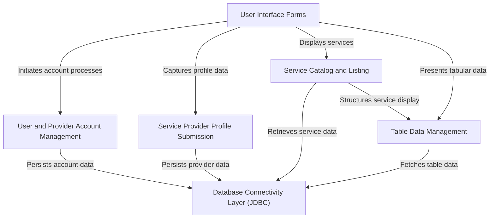

# Tutorial: Local_Service_Finder

`Local_Service_Finder` is a **Java Swing application** designed to *connect users with local service providers*. It features intuitive **user interface forms** for account management, allowing both users and service providers to sign up and log in. Service providers can **submit detailed profiles** of their offerings, which are then displayed in a browsable **service catalog**. All critical application data, including accounts and service details, is *persisted and retrieved using a robust JDBC database connectivity layer*.

## Visual Overview

## Chapters

1. [User Interface Forms
](01_user_interface_forms_.md)
2. [User and Provider Account Management
](02_user_and_provider_account_management_.md)
3. [Service Catalog and Listing
](03_service_catalog_and_listing_.md)
4. [Service Provider Profile Submission
](04_service_provider_profile_submission_.md)
5. [Table Data Management
](05_table_data_management_.md)
6. [Database Connectivity Layer (JDBC)
](06_database_connectivity_layer__jdbc__.md)

---

Generated by [AI Codebase Knowledge Builder](https://github.com/The-Pocket/Tutorial-Codebase-Knowledge).
